## Lab 5 - Password storage , Hashing

For this lab we used c# + asp.core for client-server webapp . Also we added Azure Cloud Provider for deploying wep-app 
, key-vault and db storage , in our case it was Azure DB(SQL Server). For hashing algorithm we used SHA-256 with salt.Also we store salt in a separate table.
For the security purpose we added password requirements for user like minimum 10 letters count.
Our database has next structure 

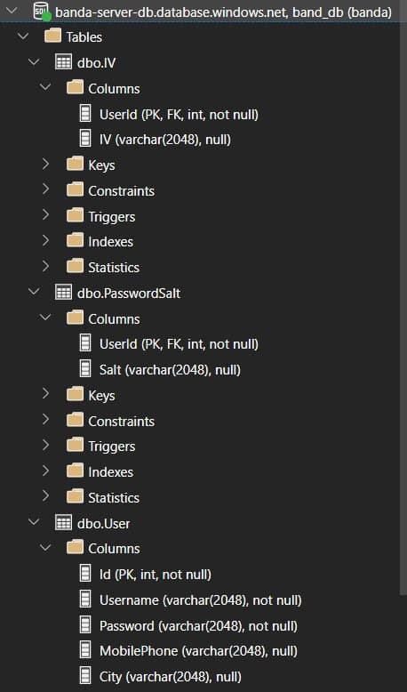

As you can see we have three tables : user , passwordSalt , IV(not interested in out case)

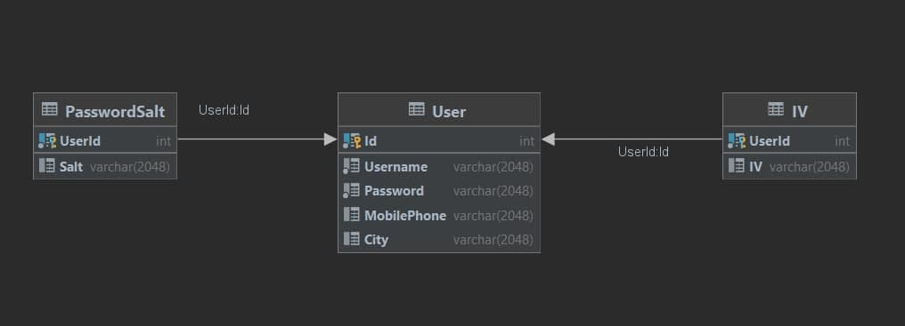

For the lab purpose , we have created registration and login form , now  will registrate one user. 
As a result we got a hashed password(with salt in separate table) + sensitive data encryption(it`s for the next lab)

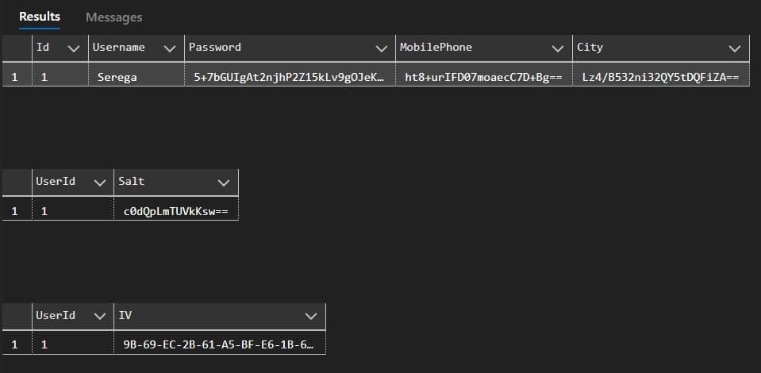

Next step we will login and check is all correct

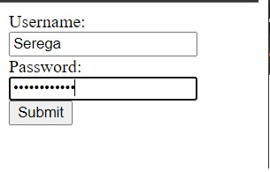
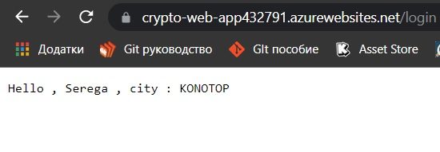

## Lab 6 - Sensitive information storage

We've added the secret key with the help of which we encoded the sensitive user data with the AES algorithm. This key is contained not in database but in Azure Key Vault as a secret (data-k). 

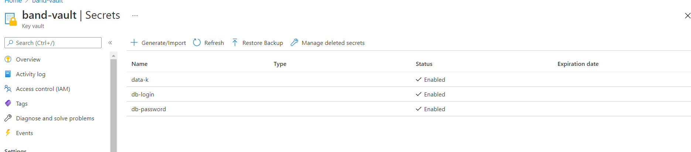

With the help of this key and the fact that AES is symmetric algorithm, we've implemented encrypting the sensitive 
personal data in the database and decrypting this info while displaying it on the profile's user page.

We keep in database initialization vector for AES algorithm per each user in hex format.

## Lab 7 - TLS configuration

We've deployed our web app in Azure.
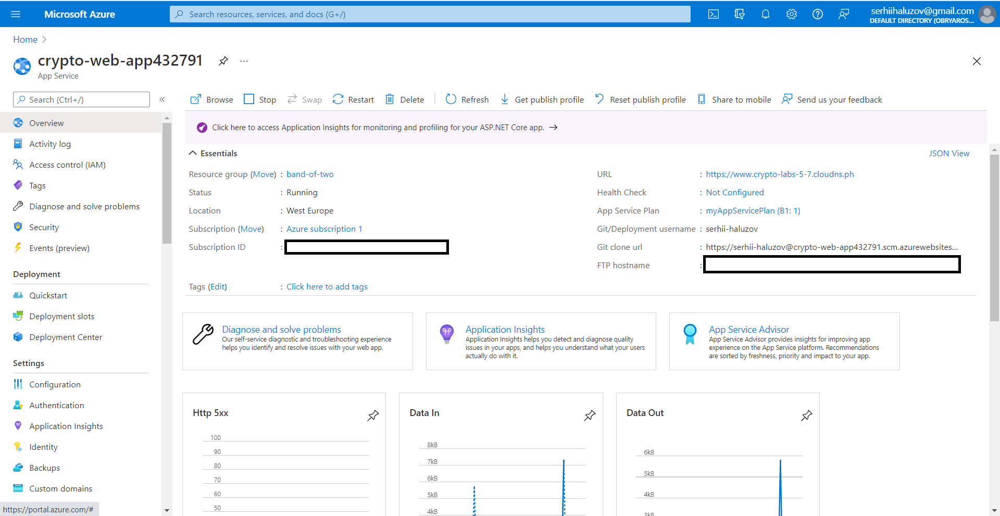

We've set the minimum TLS version as 1.2
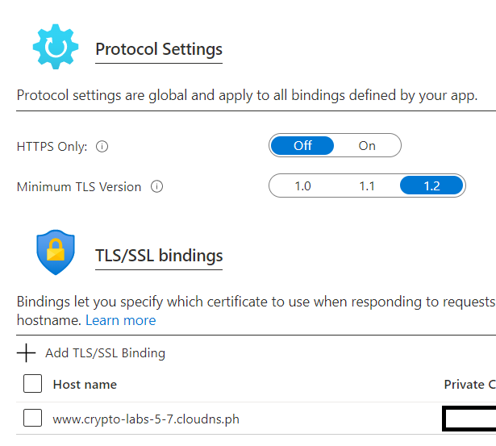

We've created the certificate in Azure Key Vault and imported it to our app
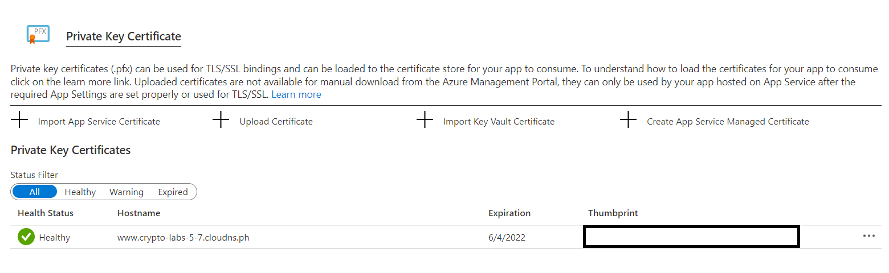

We've added our custom domain to create TLS binding to our app. 
For it we've created custom domain with the following DNS records
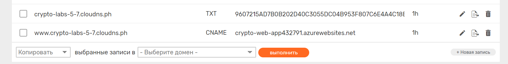

And after this we've got our new domain name with our custom created TLS certificate.

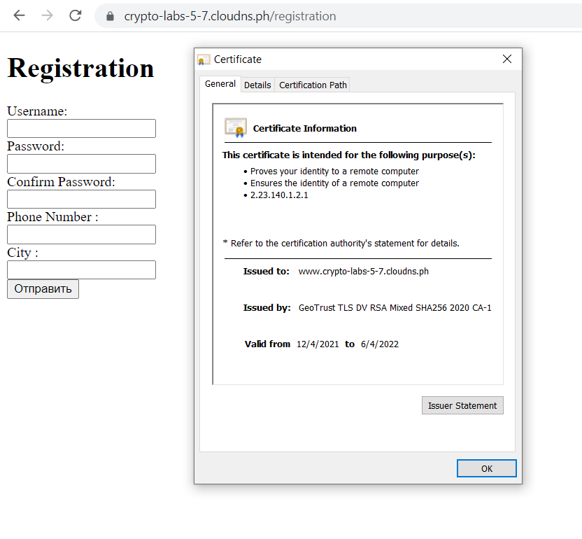